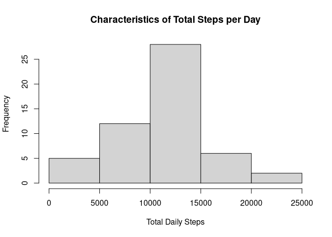
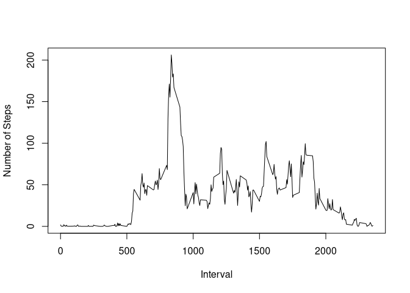
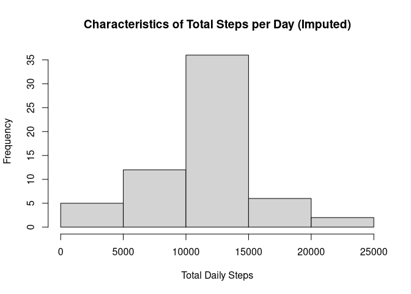
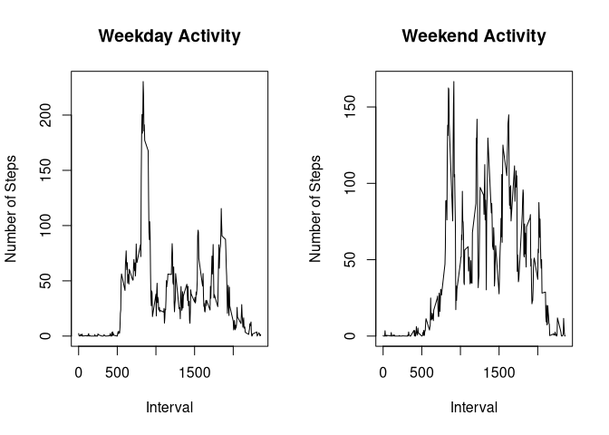

The following libraries were used: **dplyr** **xtable**


```r
library(dplyr)
library(xtable)
```

## Loading and preprocessing the data

1. Unzip the data zip file:


```r
unzip("activity.zip",overwrite = FALSE)
```

2. Read the activity.csv file into a data frame.


```r
rawActivity <- read.csv("activity.csv")
```

3. Group the activities by day to calculate daily values.


```r
groupedActivity <- group_by(rawActivity,date)
```

## What is mean total number of steps taken per day?
1. First, calculate the total steps taken per day


```r
totalActivity <- groupedActivity %>% summarize_all(sum)
```

2. Plot a histogram of the steps taken each day


```r
hist(totalActivity$steps, xlab="Total Daily Steps",
     main="Characteristics of Total Steps per Day")
```

<!-- -->

3. Next, take the mean of the steps column.


```r
mean(totalActivity$steps,na.rm=TRUE)
```

```
## [1] 10766.19
```

4. Last, take the median of the steps column.


```r
median(totalActivity$steps,na.rm=TRUE)
```

```
## [1] 10765
```

## What is the average daily activity pattern?

1. Produce a time-series plot of activity during each interval


```r
intervalAct <- group_by(rawActivity[,c(1,3)],interval)

averagedAct <- intervalAct %>% summarize_all(mean,na.rm=TRUE)

plot(x = averagedAct$interval,
     y = averagedAct$steps,
     type="l",
     xlab = "Interval",
     ylab = "Number of Steps")
```

<!-- -->

2. Calculate the interval with the highest average steps


```r
orderedAct <- arrange(averagedAct,
                      desc(averagedAct$steps))
print(xtable(orderedAct[1,]), type="html")
```

<!-- html table generated in R 4.0.3 by xtable 1.8-4 package -->
<!-- Mon Feb 22 16:04:48 2021 -->
<table border=1>
<tr> <th>  </th> <th> interval </th> <th> steps </th>  </tr>
  <tr> <td align="right"> 1 </td> <td align="right"> 835 </td> <td align="right"> 206.17 </td> </tr>
   </table>

## Imputing missing values

1. Calculate the total missing values:


```r
missing <- is.na(rawActivity)

sum(missing)
```

```
## [1] 2304
```

2. Develop a function to perform imputation of missing activity values with the mean activity value for that 5-minute interval.


```r
imputeAct <- function(actData) {
  actCol <- actData$steps
  step <- 1
  for (step in (1:length(actCol))) {
    if (is.na(actCol[step])) {
      actData[step,1] <- mean(actData[actData$interval==actData[step,3],1], na.rm=TRUE)
    }
  }
  actData
}
```

3. Create anew dataset with missing data filled in

```r
imputed <- imputeAct(rawActivity)
imputedTotal <- imputed %>% group_by(date) %>% summarise_all(sum)
```
4. Make a histogram of total steps each day

```r
hist(imputedTotal$steps, xlab="Total Daily Steps",
     main="Characteristics of Total Steps per Day (Imputed)")
```

<!-- -->

5. Calculate Mean daily steps

```r
mean(imputedTotal$steps)
```

```
## [1] 10766.19
```
6. Calculate Median daily steps

```r
median(imputedTotal$steps)
```

```
## [1] 10766.19
```
## Are there differences in activity patterns between weekdays and weekends?

1. Factorize activity data by weekend and weekday

```r
datedImputed <- imputed
datedImputed$date <- as.Date(datedImputed$date,"%Y-%m-%d")
datedImputed$dayOfWeek <- weekdays(datedImputed$date)

weekend <- function(daydata) {
  for (day in 1:length(daydata$date)) {
    dow <- daydata$dayOfWeek[day]
    if(dow=="Saturday") {
      daydata$weekend[day] <- "weekend"
    } else {
      if(dow=="Sunday") {
        daydata$weekend[day] <- "weekend"
      } else {
        daydata$weekend[day] <- "weekday"
      }
    }
  }
  daydata$weekend
}
datedImputed$dayType <- weekend(datedImputed)
datedImputed <- datedImputed %>% group_by(dayType)
```

2. Generate panel plot of steps versus intervals for weekday and weekend categories.

```r
#intervalAct <- group_by(rawActivity[,c(1,3)],interval)
#averagedAct <- intervalAct %>% summarize_all(mean,na.rm=TRUE)

weekdayAct <- subset(datedImputed,datedImputed$dayType=="weekday")
weekdayInt <- group_by(weekdayAct[,c(1,3)],interval)
weekdayAvg <- weekdayInt %>% summarize_all(mean)

weekendAct <- subset(datedImputed,datedImputed$dayType=="weekend")
weekendInt <- group_by(weekendAct[,c(1,3)],interval)
weekendAvg <- weekendInt %>% summarize_all(mean)

par(mfrow=c(1,2))

plot(x = weekdayAvg$interval,
     y = weekdayAvg$steps,
     type="l",
     xlab = "Interval",
     ylab = "Number of Steps",
     main = "Weekday Activity")

plot(x = weekendAvg$interval,
     y = weekendAvg$steps,
     type="l",
     xlab = "Interval",
     ylab = "Number of Steps",
     main = "Weekend Activity")
```

<!-- -->
